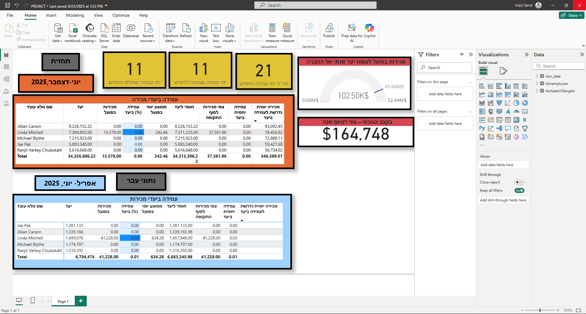
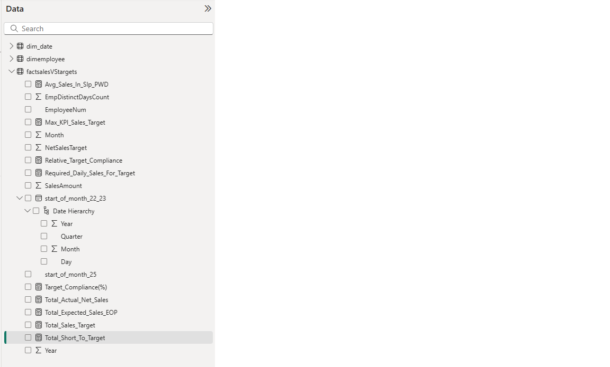
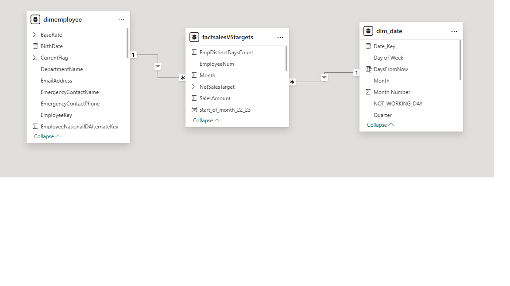

# Sales Targets BI Dashboard

A Power BI dashboard designed to monitor employees’ monthly sales performance against targets, including relative attainment calculations based on working days, period comparisons, and real-time KPI updates.

---

## 📂 Download the Dashboard
[**Click here to download the Sales Targets BI PBIX file**](PowerBI/PROJECT.pbix)  
*(Replace `PATH/TO/YOUR` with the actual GitHub path to the PBIX file in your repository.)*

---

## Dashboard Overview
The dashboard provides:
- KPI showing the number of working days completed in the current month
- Monthly sales target attainment percentage adjusted to the month’s progress
- Comparison of performance against previous periods
- Annual sales pace forecast



---

## Power BI Data Model

### Data Fields


### Table Relationships
Model relationships:
- `dimemployee[EmployeeKey]` ↔ `factsalesVStargets[EmployeeNum]`
- `dim_date[Date_Key]` ↔ `factsalesVStargets[start_of_month_22_23]`



---

## Data Sources
All data sources are provided as Excel files located in `data/raw/` and loaded into Power BI via Power Query:

- **FactDummySale.xlsx** – Actual sales transactions (shifted to 2025 using `Date.AddYears`)
- **DimEmployee.xlsx** – Employee dimension
- **Dim_Date.xlsx** – Daily date dimension with working day and holiday indicators
- **Targets.xlsx** – Monthly sales targets per employee

---

## Power Query Steps (Summary)
1. Import Excel files: `FactDummySale.xlsx`, `DimEmployee.xlsx`, `Targets.xlsx`
2. Mark working days by merging `NOT_WORKING_DAY` and `HOLIDAY` columns
3. Adjust transaction dates to 2025 with `Date.AddYears`
4. Filter only working days and limit data to the current date (`DateTime.LocalNow`)
5. Convert monthly targets to first-of-month dates (`start_of_month`)
6. Create helper table `stg_target_actual_sales` for monthly aggregation of sales and distinct working days
7. Join targets with actual sales in `factsalesVStargets`
8. Replace NULL values with 0 for numeric fields

---

## Key DAX Measures
```DAX
Total Sales := SUM(FactDummySale[SalesAmount])

Target Amount (Month) :=
VAR _start = MIN(Dim_Date[StartOfMonth])
RETURN CALCULATE(
    SUM(Targets[TargetAmount]),
    Dim_Date[StartOfMonth] = _start
)

Working Days in Month :=
CALCULATE(
    COUNTROWS(Dim_Date),
    Dim_Date[IsWorkingDay] = TRUE(),
    ALLEXCEPT(Dim_Date, Dim_Date[Year], Dim_Date[MonthNumber])
)

Elapsed Working Days (to Today) :=
CALCULATE(
    COUNTROWS(Dim_Date),
    Dim_Date[IsWorkingDay] = TRUE(),
    Dim_Date[Date] <= TODAY(),
    ALLEXCEPT(Dim_Date, Dim_Date[Year], Dim_Date[MonthNumber])
)

Relative Target Attainment :=
DIVIDE(
  [Total Sales],
  [Target Amount (Month)] * DIVIDE([Elapsed Working Days (to Today)], [Working Days in Month])
)

YoY Sales := CALCULATE([Total Sales], DATEADD(Dim_Date[Date], -1, YEAR))
